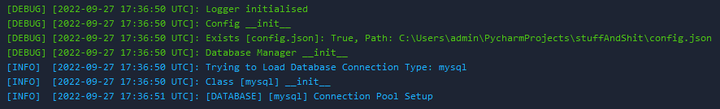
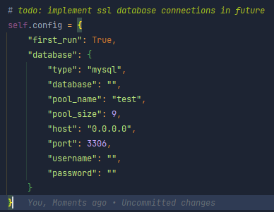
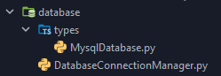

## Basic Python Project:
##### can be picked apart for useful classes and implementations

## currently, implemented:

### Logger:

### Json Config:

### Database types

##current packages:

 - pendulum: 2.1.2+
 - mysql:    0.0.3+
 - mysql-connector-python: 8.0.30+
